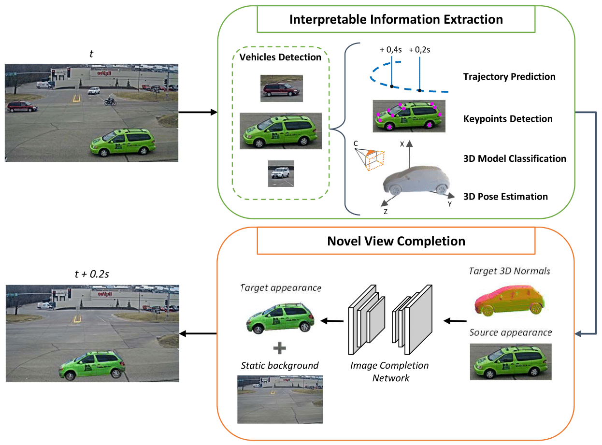

# Future urban scene generation through vehicle synthesis

This repository contains Pytorch code for the [ICPR2020](https://www.micc.unifi.it/icpr2020/) paper 
"Future Urban Scene Generation Through Vehicle Synthesis" [[arXiv](https://arxiv.org/abs/2007.00323)]

<p align="center">
  
</p>

```bibtext
@article{simoni2020future,
  title={Future Urban Scenes Generation Through Vehicles Synthesis},
  author={Simoni, Alessandro and Bergamini, Luca and Palazzi, Andrea and Calderara, Simone and Cucchiara, Rita},
  journal={arXiv preprint arXiv:2007.00323},
  year={2020}
}
```

## Abstract

In this work we propose a deep learning pipeline to predict 
the visual future appearance of an urban scene. Despite 
recent advances, generating the entire scene in an 
end-to-end fashion is still far from being achieved. 
Instead, here we follow a two stage approach, where 
interpretable information are included in the loop and 
each actor is modelled independently. We leverage a 
per-object *novel view synthesis* paradigm; i.e. 
generating a synthetic representation of an object 
undergoing a geometrical roto-translation in the 3D space. 
Our model can be easily conditioned with constraints (e.g. 
input trajectories) provided by state-of-the-art tracking 
methods or by the user.

<p align="center">
  
</p>

---

## Code
Code was tested with an Anaconda environment (Python version 3.6) on both Linux and Windows based systems.

### Install

Run the following commands to install all requirements in a 
new virtual environment:

```bash
conda create -n <env_name> python=3.6
conda activate <env_name>
pip install -r requirements.txt
```

Install [PyTorch](https://pytorch.org/) package (version 1.3 or above).

### How to run test

To run the demo of our project, please firstly download all 
the required data at this [link](https://drive.google.com/open?id=1MRuA12odExKqBiMcYJAl2QSFAhggfaCu) 
and save them in a `<data_dir>` of your choice. We tested 
our pipeline on the **Cityflow** dataset that already have 
annotated bounding boxes and trajectories of vehicles.

The test script is `run_test.py` that expects some 
arguments as mandatory: video, 3D keypoints and checkpoints 
directories.

```bash
python run_test.py <data_dir>/<video_dir> <data_dir>/pascal_cads <data_dir>/checkpoints --det_mode ssd512|yolo3|mask_rcnn --track_mode tc|deepsort|moana --bbox_scale 1.15 --device cpu|cuda
```

Add the parameter `--inpaint` to use the inpainting on the 
vehicle instead of the static background.

### Description and GUI usage

If everything went well, you should see the main GUI in 
which you can choose whichever vehicle you want that 
was detected in the video frame or change the video frame.

<p align="center">
  
</p>

The commands working on this window are:
1) `RIGHT ARROW` = go to next frame
2) `LEFT ARROW` = go to previous frame
3) `SINGLE MOUSE LEFT BUTTON CLICK` = visualize car 
trajectory
4) `BACKSPACE` = delete the drawn trajectories
5) `DOUBLE MOUSE LEFT BUTTON CLICK` = select one of the 
vehicles bounding boxes

Once you selected some vehicles of your chioce by 
double-clicking in their bounding boxes, you can push the 
`RUN` button to start the inference. The resulting frames 
will be saved in `./results` directory.
